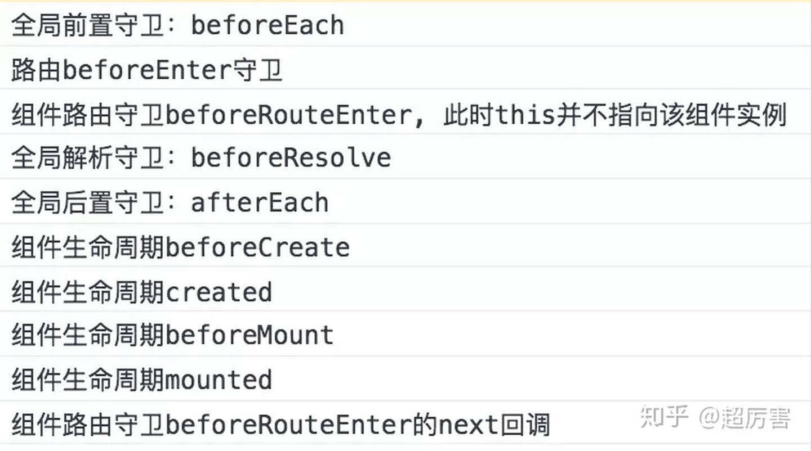

### 钩子函数种类有:全局路由钩子、独享路由钩子、组件内路由钩子
钩子函数执行后输出的顺序截图

当点击切换路由时：beforeRouterLeave-->beforeEach-->beforeEnter-->
beforeRouteEnter-->beforeResolve-->afterEach-->beforeCreate-->created-->
beforeMount-->mounted-->beforeRouteEnter的next的回调

当路由更新时：beforeRouteUpdate

全局路由钩子：
【全局的】：是指路由实例上直接操作的钩子函数，他的特点是所有路由配置的组件都会触发，直白点就是触发路由就会触发这些钩子函数，
如下的写法。钩子函数按执行顺序包括beforeEach、beforeResolve（2.5+）、afterEach三个（以下的钩子函数都是按执行顺序讲解的）：
beforeEach(to,from, next)、beforeResolve(to,from, next)、afterEach(to,from)；

独享路由钩子：
【路由独享的】是指在单个路由配置的时候也可以设置的钩子函数，其位置就是下面示例中的位置，
也就是像Foo这样的组件都存在这样的钩子函数。目前他只有一个钩子函数beforeEnter：
beforeEnter(to,from, next)；

组件内路由钩子：
是指在组件内执行的钩子函数，类似于组件内的生命周期，相当于为配置路由的组件添加的生命周期钩子函数。
钩子函数按执行顺序包括beforeRouteEnter、beforeRouteUpdate (2.2+)、beforeRouteLeave三个
beforeRouteEnter(to,from, next)、beforeRouteUpdate(to,from, next)、beforeRouteLeave(to,from, next)

#### 完整的导航解析流程:
导航被触发。
在失活的组件里调用 beforeRouteLeave 守卫。
调用全局的 beforeEach 守卫。
在重用的组件里调用 beforeRouteUpdate 守卫 (2.2+)。
在路由配置里调用 beforeEnter。
解析异步路由组件。
在被激活的组件里调用 beforeRouteEnter。
调用全局的 beforeResolve 守卫 (2.5+)。
导航被确认。
调用全局的 afterEach 钩子。
触发 DOM 更新。
调用 beforeRouteEnter 守卫中传给 next 的回调函数，创建好的组件实例会作为回调函数的参数传入。

### 导航守卫回调参数
form 来自哪里
to   要去哪里
next 重要参数 串联整个router
