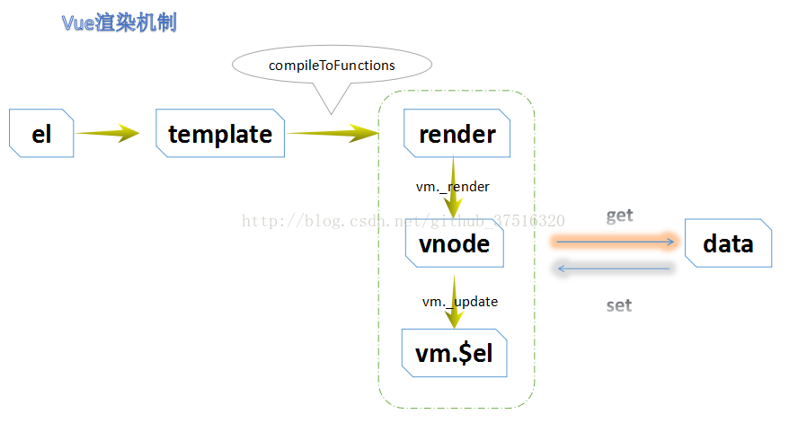

Vue 的$mount()为手动挂载，在项目中可用于延时挂载（例如在挂载之前要进行一些其他操作、判断等），
之后要手动挂载上。new Vue时，el和$mount并没有本质上的不同

### $mount所做的工作从大体来讲主要分为3步：

* 1.如果你的option里面没有 render 函数，那么，
  通过 compileToFunctions 将HTML模板编译成可以生成VNode的Render函数。

* 2.new 一个 Watcher 实例，触发 updateComponent 方法。

* 3.生成vnode，经过patch，把vnode更新到dom上。 由于篇幅有限，这里先说前两步，
  第三步下篇说。 好，下面具体的说。