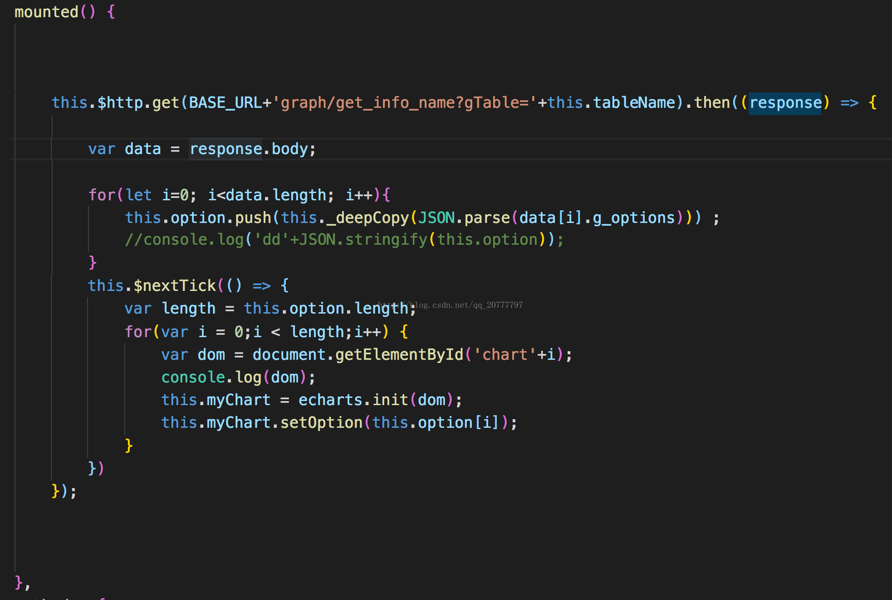

* vue中实现先请求数据再渲染dom

template v-for 动态生成dom，在mounted里面请求接口返回数据后获取dom 得到undefined

解决办法

“如果有依赖dom必须存在的情况，就放到mounted(){this.$nextTick(() => { /* code */ })}

* vue给组件绑定自定义事件无效怎么解决？
  两种方式
  1、组件外部加修饰符.navtive
  2、组件内部声明$emit('自定义事件')