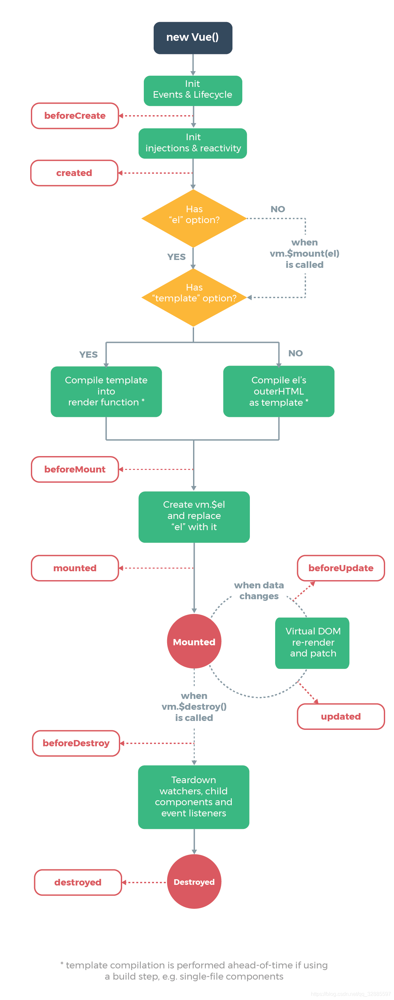

#### vue生命周期有哪些，都干了什么

一、创建
* 1、beforeCreate：这个阶段实例已经初始化，只是数据观察与事件机制尚未形成，不能获取DOM节点（没有data，没有el）
使用场景：因为此时data和methods都拿不到，所以通常在实例以外使用
* 2、created：实例已经创建，仍然不能获取DOM节点（有data，没有el）
使用场景：模板渲染成html前调用，此时可以获取data和methods，so 可以初始化某些属性值，然后再渲染成视图，异步操作可以放在这里

二、载入
* 1、beforeMount：是个过渡阶段，此时依然获取不到具体的DOM节点，但是vue挂载的根节点已经创建（有data，有el）
* 2、mounted：数据和DOM都已经被渲染出来了
使用场景：模板渲染成html后调用，通常是初始化页面完成后再对数据和DOM做一些操作，需要操作DOM的方法可以放在这里

三、更新
* 1、beforeUpdate：检测到数据更新时，但在DOM更新前执行
* 2、updated：更新结束后执行
使用场景：需要对数据更新做统一处理的；如果需要区分不同的数据更新操作可以使用$nextTick

四、销毁
* 1、beforeDestroy：当要销毁vue实例时，在销毁前执行
* 2、destroyed：销毁vue实例时执行

第一次页面加载会触发哪些钩子
beforeCreate、created、beforeMount、mounted

