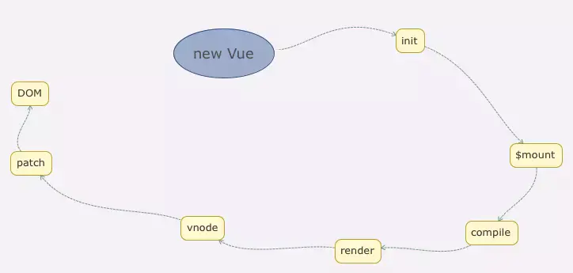
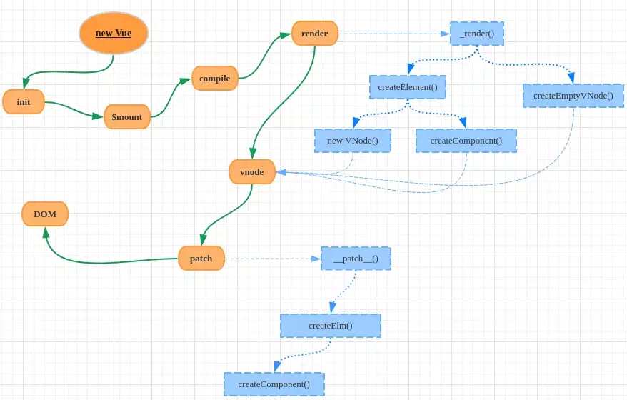

vue中dom渲染过程

render到patch
* Vue在渲染的时候先调用原型上的_render函数将组件对象转化成一个VNode实例；而_render是通过调用createElement和createEmptyVNode两个函数进行转化；
* createElement的转化过程会根据不同的情形选择new VNode或者调用createComponent函数做VNode实例化；
* 完成VNode实例化后，这时候Vue调用原型上的_update函数把VNode渲染成真实DOM，这个过程又是通过调用patch函数完成的（这就是patch阶段了）

* 1、响应式
监听data属性的getter setter
* 2、模板编译
模板到render函数再到vnode。模板不是html，有指令、插值、js表达式，能够实现循环、判断。
html是标签语言，只有js才能实现循环判断。因此，模板一定要转化成js，即编译模板。
模板编译为render函数、执行render函数返回的vnode
* 3、收集依赖
在模板中使用那个变量就把那个变量观察起来（watch），
这部分主要实现了从vdom转化为真实DOM、vnode新旧节点的对比操作。

数据更改触发的渲染过程
### 1、初次渲染过程
* 1）解析模板为render函数
* ）触发响应式，监听data属性的getter、setter
* ）执行render函数，生成vnode、patch（elem.vnode）
### 2、更新过程
* ）修改data，触发setter
* ）重新执行render函数，生成newVnode
* ）patch(vnode,newVnode)更新视图