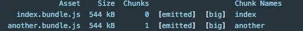

代码分割（code
splitting）是webpack相当重要的一个特性。它可以让代码分割到不同的文件（bundle）中，以便按需或者并行加载这些文件。代码分割可以得到更小的文件，控制资源加载的优先级。如果使用得当，更是可以优化加载的时间。

这里先看一个使用 vue-cli 构建的实际项目打包出来的 bundle 都有什么


这里只关注 js 文件。可以看到除了上篇文章提到的 app、vendor、manifest文件，还有从0到7开头的 js 文件。 这几个以数字开头的 js 文件是哪里来的，又有什么作用呢。这篇文章就是解答这个问题。

## 代码分割的方法

官网给出了三种常用的代码分割的方法

* Entry Points：入口文件设置的时候可以配置
* CommonsChunkPlugin：上篇文章讲了一下应用，更详细的信息可以查看官网 
* Dynamic Imports：动态导入。通过模块的内联函数调用来分割，这篇文章主要会结合 vue-router 分析一下这种方式

### Entry Points

这种是最简单也是最直观的代码分割方式，但是会存在一些问题。方法就是在 webpack 配置文件中的 entry 字段添加新的入口：

````java
const path = require('path');

module.exports = {
entry: {
index: './src/index.js',
another: './src/another-module.js'
},
output: {
filename: '[name].bundle.js',
path: path.resolve(__dirname, 'dist')
}
};
````

将生成下面的构建结果：


看上去是分割出来了一个新的 bundle。但是会有两个问题： 如果入口 chunks 之间包含重复的模块，那些重复模块都会被引入到各个 bundle 中 这种方法不够灵活，并且不能将核心应用程序逻辑进行动态拆分代码 举个例子，index 和
another 这两个入口文件都包含了 lodash 这个模块， 那分割出来的两个 bundle 都会包含 lodash 这个模块，冗余了。 解决这个问题就需要 CommonsChunkPlugin 插件。

### CommonsChunkPlugin

这个插件可以抽取所有入口文件都依赖了的模块，把这些模块抽取成一个新的bundle。具体用法如下：

```java
const path = require('path');

module.exports = {
entry: {
index: './src/index.js',
another: './src/another-module.js'
},
plugins: [
new webpack.optimize.CommonsChunkPlugin({
name: 'common' // bundle 名称
})
],
output: {
filename: '[name].bundle.js',
path: path.resolve(__dirname, 'dist')
}
};
```

构建结果如下：


使用CommonsChunkPlugin之后 可以看到，原来的 index 和 another 两个bundle的体积大大的减小了。
并且多了一个574k的 common bundle。 这个文件就是抽离出来的 lodash
模块。这样就可以把业务代码，和第三方模块代码分割开了。

CommonsChunkPlugin 在 vue-cli 中的使用可以查看上篇文章。其他更高级的用法可以查看官网。

### Dynamic Imports

Webpack 的动态分割主要方式是使用符合 ECMAScript 提案的 import() 语法。语法如下

import('path/to/module') -> Promise

传入模块的路径，import() 会返回一个Promise。这个模块就会被当作分割点。 意味着这个模块和它的子模块都会被分割成一个单独的 chunk。并且，在 webpack 配置文件的 output 字段， 需要添加一个
chunkFileName 属性。它决定非入口 chunk 的名称。

```java
// vue-cli 生成的webpack.prod.conf.js
// 注意 output 的 chunkFilename 属性
// 这种写法分割出来的 bundle 会以 id + hash 的命名方式
// 比如 1.32326e28f3acec4b3a9a.js
output: {
path: config.build.assetsRoot,
filename: utils.assetsPath('js/[name].[chunkhash].js'),
chunkFilename: utils.assetsPath('js/[id].[chunkhash].js')
},
```

这个动态代码分割功能是我们实现按需加载的前提。在 vue 的项目里，我们最终想要达到这样一个效果：

* 把每个路由所包含的组件，都分割成一个单独的 bundle
* 当路由被访问的时候才加载该路由对应的 bundle

第一个点通过上面的 import() 就已经可以实现了。要实现第二点，需要用到 vue 里面的异步组件特性。

Vue 允许将组件定义为一个工厂函数，异步地解析组件的定义。只在组件需要渲染时触发工厂函数， 
并且把结果缓存起来，用于后面的再次渲染。工厂函数的写法：

``java
Vue.component('async-example', function (resolve, reject) 
{ setTimeout(function () { // 将组件定义传入 resolve 回调函数 resolve({ template: '<div>I am async!</div>'
})
}, 1000)
})
``

在工厂函数中可以返回 Promise，而 import() 也是返回 Promise 的，
这样就把异步组件和 import() 结合起来了。使用 import() 后，工厂函数的写法：

```java
Vue.component('async-webpack-example', // 该 `import` 函数返回一个 `Promise` 对象。
() => import('./my-async-component')
)
```

最后在 vue-router 的路由配置中，我们只需要这么写：

```java
const router = new VueRouter({ routes: [
{ path: '/login', component: () => import('@/views/login'), }, 
{ path: '/home', component: () => import('@/views/home'), }
]
})
```

结合 Vue 的异步组件和 Webpack 的代码分割功能，在 vue-router 中，我们轻松实现了路由组件的按需加载加载。
所以，文章开头的问题在这里就可以解答了。以0-7数字开头的 js 文件，就是每个路由对应的组件构建出来的
bundle。只有用户访问对应的路由时，才会加载相应的 bundle，提高页面加载效率。

我们来看一下效果。进入首页时，页面载入的 js 文件如下图：


当切换到另一个路由时，发现只会加载该页面对应的 1.js。


切换路由之后 可以看到，按需加载达到效果了（图中的 js 文件命名里没有hash，是因为这是开发环境）。
