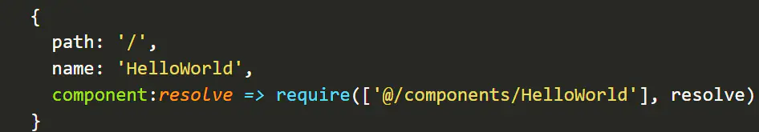
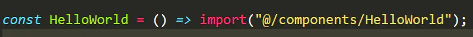

### 为什么Vue采用异步渲染呢
Vue 是组件级更新，如果不采用异步更新，那么每次更新数据都会对当前组件进行重新渲染，
所以为了性能，Vue 会在本轮数据更新后，在异步更新视图。核心思想nextTick 。
dep.notify（） 通知 watcher进行更新，subs[i].update 依次调用 watcher 的update ，
queueWatcher 将watcher 去重放入队列， nextTick（flushSchedulerQueue ）在下一tick中刷新watcher队列（异步）。

### 1.什么是异步组件？
异步组件就是定义的时候什么都不做，只在组件需要渲染（组件第一次显示）的时候进行加载渲染并缓存，缓存是以备下次访问。

### 2.Vue实现按需加载
Vue实现按需加载，官方推荐使用结合webpack的代码分割功能进行。
定义为异步加载的组件，在打包的时候，会打包成单独的js文件存储在static/js文件夹里面，
在调用时使用ajax请求回来插入到html中。

### 3.webpack的代码分割

这里的require是AMD规范的引入关键词，resolve是全部引入成功以后的回调函数，
第一个参数是依赖，require会先引入依赖模块，再执行回调函数。

### 4.webpack 2 + ES2015

推荐使用，但是webpack > 2.4。这里的import()方法由es6提出，
import()方法是动态加载，返回一个Promise对象，then方法的参数是加载到的模块。
类似于Node.js的require方法，主要import()方法是异步加载的。

在路由配置的时候直接调用HelloWorld就可以了。

import是一个运算符，返回一个Promise，模块加载完成，则Promise resolve vue组件。

好像就是定义了一个函数，函数不调用的时候就不执行啊，对不对？只要在什么地方调用了，才会执行。在路由配置的时候调用，才会去执行，去加载这个模块呀。我说的是不是很有道理！

### 5.webpack的另一种代码分割(推荐)
此方法，多个路由指定相同的hcunkName，会打包成一个js文件。vue官网推荐使用webpack的代码分割进行懒加载。此方法依赖于Promise。

webpack代码分割
webpack编译时，会静态的解析代码中的require.ensure()，同时将模块添加到一个分开的chunk中，新的chunk会被webpack通过jsonp来按需加载。此方法内部依赖于Promise。

参数1：是字符串数组，模块的依赖，会提前加载。一般都是空的。

参数2：依赖项加载完成之后的回调函数

所有的依赖加载完成之后，webpack会执行这个回调函数，require对象的一个实现会作为一个参数传递给回调函数，因此，可以require依赖和其他模块提供下一步的执行。

参数3：chunk名称

相同chunk名称的文件 所有依赖都会被放进相同文件束。

我解释一下这个原理啊，在网上找了挺久，都是使用方法，不知道它到底做了什么，才实现的异步加载。

webpack把这个模块导出一个js文件，然后用到这个模块的时候，就动态构造script标签插入DOM，再由浏览器去请求。回调函数是在依赖加载完成之后执行。
