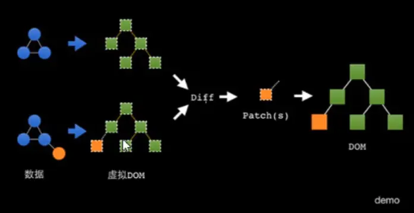
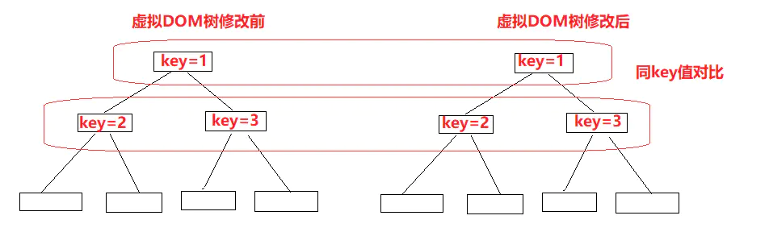
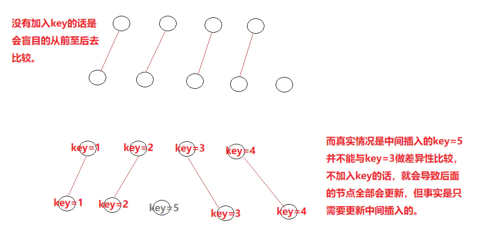

### 1、虚拟DOM
虚拟DOM本质上是JavaScript对象,是对真实DOM的抽象
状态变更时，记录新树和旧树的差异
最后把差异更新到真正的dom中
虚拟DOM，也就是虚拟节点，本质上是使用js对象来模拟真实DOM中存在的节点，这个对象具有真实DOM的特性。
如：
真实dom：
```html
<div id="app">
  <h1>dom元素<h1>
</div>
```
虚拟dom：
```vue
{
    tag:'div',
    attrs:{
      // 表示该节点的属性
       id:'app'
    },
    children:[
      {
        tag:'h1',
        text:'dom元素'
      }
    ]
}
```
### 1、使用虚拟DOM的原因
不断的修改真实的DOM会引发回流和重绘，大大降低了页面的渲染能力，而虚拟DOM的产生则是减少了频繁操作DOM而带来的一系列性能问题。

#### 1.2、使用虚拟DOM真正的意义
虚拟DOM的频繁改变会产生一系列性能问题，而使用虚拟DOM替代真实DOM，最大的优势在于不断的去修改虚拟DOM后，才会一次性的与真实DOM的差异性做对比，然后只会去修改真实的DOM一次。而这种差异性对比，也就是diff算法。

### 2、diff算法
当虚拟DOM的某个节点发生了变化，会生成一个新的VNode，然后通过新的VNode与之前的旧的VNode进行对比，把不同的地方修改在真实的DOM上，在将旧的VNode更新节点的值。
diff过程的核心就是去使用patch函数，对比新老节点，然后修改真实DOM。



#### diff过程：

#### 1、按照树的层级划分


#### 2、同key值比较


#### diff算法的特性
当最外层的根节点发生改变，那么diff算法默认内部发生了翻天覆地的变化，因此，diff算法更新节点的发生是采用react的策略：删除旧的节点，再去创建一个新的节点。
如：
旧的虚拟DOM：
```vue
{
    tag:'div',
    attrs:{
      // 表示该节点的属性
       id:'app'
    },
    children:[
      {
        tag:'h1',
        text:'dom元素'
      }
    ]
}
```
新的虚拟DOM：
```vue
{
    tag:'p',
    attrs:{
      // 表示该节点的属性
       id:'app'
    },
    children:[
      {
        tag:'h1',
        text:'dom元素'
      }
    ]
}
```
尽管内部的数据还是一样的，但是此时diff并不会去进行差异性比较，而是将旧的div节点直接删除，直接新建一个p节点。
#### 证明理由：
在Vue的transition过渡动画中，会出现这种情况，当是复用的组件使用过渡动画时，是不会产生过渡效果的，而不同的组件使用动画时，是能使用过渡效果的，产生这种问题的原因就是上述所说的，当组件复用时，没有创建销毁的过程，只是根据diff去进行差异性比较。


