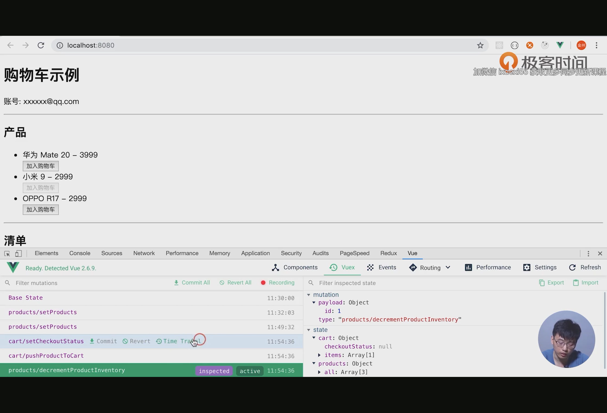

下面这些库可以在所有项目中使用

UI框架: Element, iView, vue-strap, mint-ui等
注：UI风格目前有Bookstrap、Antd和Google Materials三种风格，在项目搭建时这也是一个很重要的技术选型。

日期: moment, dayjs

URL解析: query-string, path-to-reqexp

实用方法: lodash

Cookie: js-cookie

混淆ID: hashids

图表: echarts

Ajax: axios, isomorphic-fetch, vue-apollo

拖拽: Vue.Draggable

Meta修改: vue-meta