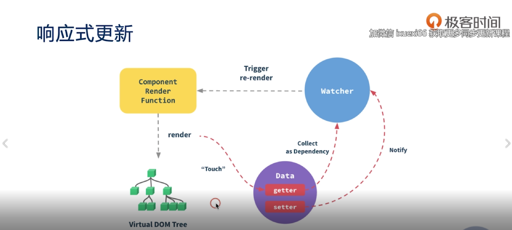

### vue如何做响应式更新的

* vue在实例化的时候会对data() 里面的数据做一个getter、setter的转化
* 组件在渲染的时候会把需要用到的数据放到 watcher里面，没有用到不会进入到watcher里面
* 当data数据改变了，会通知watcher更新view

### 数据驱动
vue dom的更新是用数据变化来触发的
vue的核心思想是数据驱动，任何直接更改dom的行为都是不可取的

### 数据来源（单向的）
* 来自父元素的数据
* 来自组件自身的状态
* 来自状态管理器 如vuex，vue.observable(2.6新增的api)

### 状态和属性的区别 data vs props
* 状态是组件自身的数据
* 属性来自父组件的数据
* 状态的改变不一点会触发更新
* 属性的改变也不一定会触发更新
